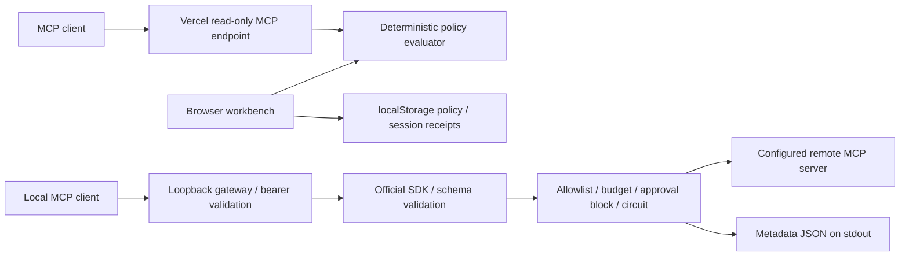
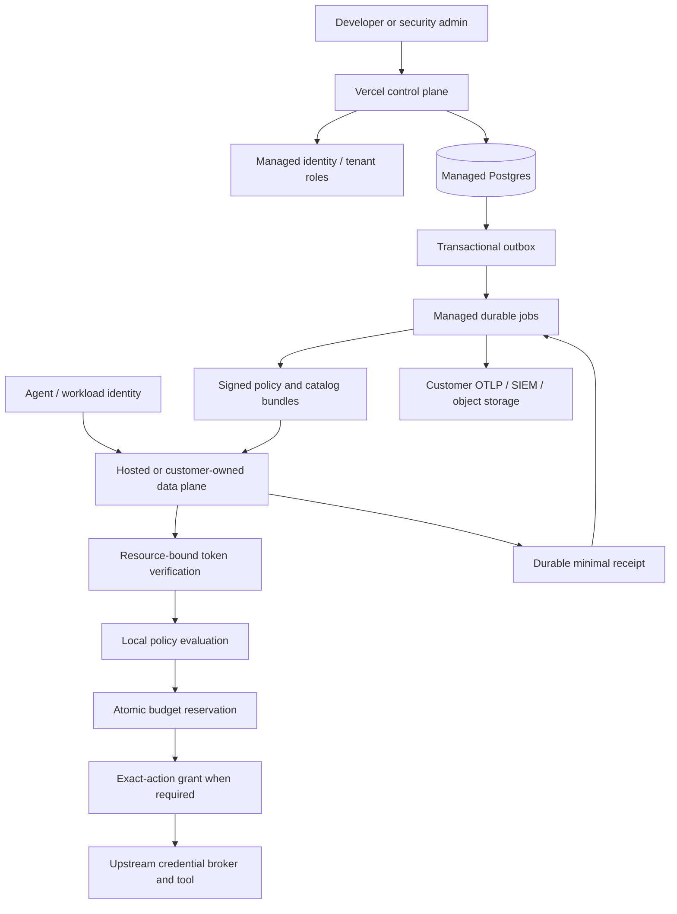

# Architecture and trust boundaries

## Shipped baseline

The browser does not call upstream systems. Public MCP caller-supplied counts are simulation metadata. The local gateway uses an internal count instead. There is no shared persistent identity or audit store.

## Target architecture, not yet implemented

## Request lifecycle

1. Identify tenant, verified workload, delegated user, connection, and environment.
2. Read a validated, signed, unexpired policy/catalog revision.
3. Validate schema and canonicalize arguments; never take action authority from tool descriptions.
4. Authorize the exact resource/action and atomically reserve budget.
5. Require a durable, single-use exact-action grant for risky operations.
6. Forward using a separate scoped upstream credential. No incoming token passthrough.
7. Record an outcome. Timeout or disconnect after forwarding means unknown until reconciled.
8. Commit metadata evidence and usage in a durable store; deliver exports asynchronously.

## Production model

Tables: tenants, memberships, workloads, connections, tool_revisions, policies, policy_revisions, approval_runs, attempts, receipts, usage_entries, outbox_events. All domain rows carry tenant_id; database authorization and query scoping both enforce it. Store principal IDs, never name-based joins. Secrets live encrypted outside browser-visible records.

Approval binding: tenant + principal + connection + destination + tool revision + canonical arguments commitment + policy revision + budget reservation + expiry + nonce. Authorization and execution claim use a transaction or compare-and-swap. A transport session ID is not a durable run ID.

Evidence v1 proposal: event_id, run_id, attempt_id, tenant_id, principal_id, tool_id, schema_hash, argument_commitment, policy_hash, decision, rule_id, approval_id, timestamps, outcome, upstream_reference, previous_digest, signing_key_id, signature. This is not the baseline unsigned v0 receipt format.

## Failure policy

- Unknown tenant/identity, missing policy, expired bundle, revoked credential: deny.
- Budget store unavailable: fail closed for governed production actions.
- Audit sink unavailable: persist to outbox; configured high-assurance actions stop if durable local recording fails.
- Upstream timeout on a write: unknown; no blind automatic retry.
- Control plane outage: continue only within the configured policy lease, then deny high-risk actions. Document revocation delay.
- Custom domain ownership: verify ownership before binding, isolate tenant host routing, and handle renewal/abuse.
- Remote URL onboarding: HTTPS, egress policy, blocked internal/link-local/metadata destinations, DNS validation at connection time, no credential-bearing redirect, response byte/time ceilings.

## Current known limits

Single-process quota/circuit resets, shared principal, loopback bind, two upstreams, 100 allowed tools, startup-only schema discovery, no runtime response projection or cache, no output byte cap, no durable write idempotency/approval or audit delivery. Only configured trusted upstreams should be used for evaluation. Do not expose the local preview as a production multi-tenant gateway.
