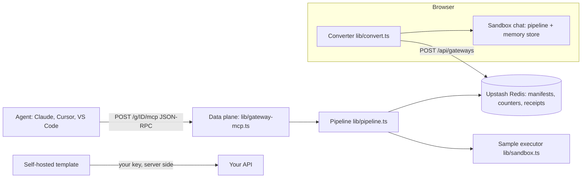

# Accord blueprint: gateway, converter, control plane

Mission deliverables 1 to 3, 14-09-2026. Shipped means live and tested today. Staged means designed and not built.

## 1. System architecture

- **Converter (the wedge, shipped):** cURL, OpenAPI 3.x, Swagger 2, Postman 2.1 to MCP tool definitions. It is pure and isomorphic, never throws, removes secrets, and is fuzz-tested.
- **Data plane (shipped for the sandbox):** Vercel Node function, official MCP SDK, stateless Streamable HTTP with JSON responses. One MCP server per request, built from the stored manifest.
- **Control plane (staged):** accounts, tenants, encrypted upstream secrets, policy editing, audit export. See docs/STRATEGY.md, checkpoints 2 to 6.

## 2. Contracts

- **Transport:** MCP JSON-RPC 2.0 over Streamable HTTP. `initialize`, `tools/list` and `tools/call` go through the official SDK. Parse errors return -32700, schema errors are handled by the SDK, unknown gateways return 404 with -32001, and an unavailable store returns 503 with -32000.
- **Manifest:** `accord.manifest/v1` = `{ name, baseUrl, auth: { type, header | name }, headers, tools: [{ name, title, description, method, path, server?, inputSchema, annotations, params, responseSchema? }] }`. It never holds secret values.
- **Policy (tool filter schema):** `accord.gateway-policy/v1`, validated by zod in lib/pipeline.ts. Fields: roles (allow and deny globs over name or path, plus readOnly), defaultRole, requireApproval, loop, rate, callLimit, cacheSeconds, cache, strip, redact, prune.
- **Middleware pipeline:** input (closed) → rbac (closed) → schema (closed) → approval (closed) → loop (closed) → rate token bucket (closed) → quota (closed) → cache (open) → execute → strip (open) → prune (open) → redact (closed) → receipt (open).
- **Receipt:** `accord.receipt/v1` with id, time, gateway, role, tool, argsDigest, policyDigest, effect, rule, outcome, cached, latencyMs, bytesIn, bytesRaw, bytesOut and redacted.

## 3. Phase 1 status

| Item | Status |
| --- | --- |
| Converter, 4 input formats, secret removal, fuzz tests | Shipped |
| Sandbox gateway URL, 1,000-call cap, 30-day TTL | Shipped |
| Loop breaker, token bucket, quota, RBAC filtering, approval hold | Shipped |
| Strip, prune, redact, exact cache, measured byte savings | Shipped |
| Self-hosted template (Vercel, Docker, Railway, Node) with bearer auth | Shipped |
| JWT/OAuth identity broker, verified principals | Staged, checkpoint 2 |
| Real forwarding on the hosted gateway (SSRF defences, encrypted secrets) | Staged, checkpoint 3 |
| Slack or Teams approval with durable resume | Staged, checkpoint 5 |
| OTel or SIEM export, signed receipts | Staged, checkpoint 6 |
| Semantic cache | Deferred until false-hit costs are measured |
